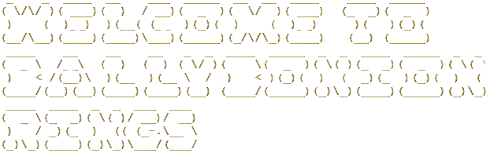

[Live site hosted on Heroku](https://ballybonion-rings-709267bfe701.herokuapp.com)

BallybOnion Rings is a command-line application created in Python. Designed for a fictional fast food chain based in Ballybunion, Co. Kerry, Ireland, this application seeks to replicate the functionality of a touchscreen kiosk found in fast food outlets such as McDonalds, Burger King, and other chains. Users are welcomed to the restaurant, threatened with legal action if they loiter, and offered a selection of items across several sub menus within a user-friendly and easily-navigable environment. 

## UX

A colour scheme of green and gold was selected as these are the colours of the Co. Kerry flag. A sense of parochial populism is inherent in the very name of the company, so this colour scheme was considered sufficient. 

The Pyfiglet module was used to provide additional styling to the menu screens, while the Colorama module was used to provide colour.  

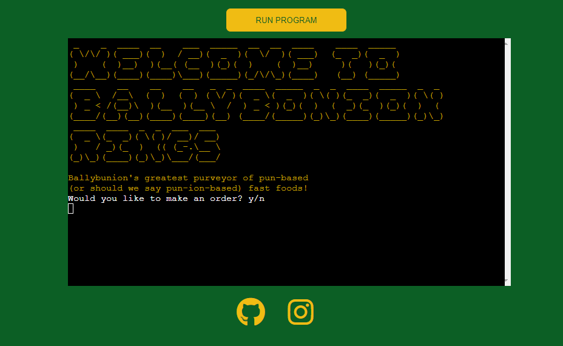

## User Stories

- As a user, I would like to easily navigate the menu of the restaurant, so that I can make an informed decision about my order.
- As a user, I would like to have the ability to change my order, in case I order the wrong item my mistake.
- As a user, I would like the kiosk to work well so that I can make an order without having to deal with bugs that would stress me out and detract from my experience.
- As a user, I would like to get a collection number at the end of my order, so that I can collect my food from the counter when it's ready.

## Features

### Existing Features

#### Welcome Screen

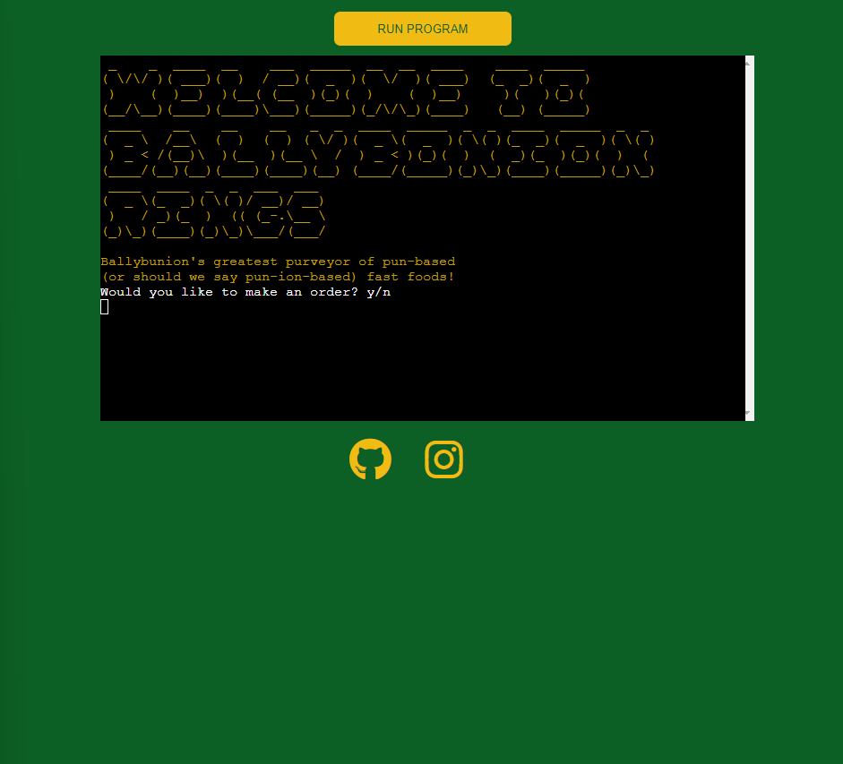

The first screen welcomes the user to the restaurant, orienting them within the application with a clear starting point. 

#### Run Program Button

The button at the top of the site reloads the page and restarts the application.

#### Social Media Links in Footer

Two functional links can be accessed by clicking the two Font Awesome-sourced icons within the footer. The icons are stylised to match the colour scheme of the site. The links open in new tabs, leaving the application browser tab open. 

#### Browser Tab Title

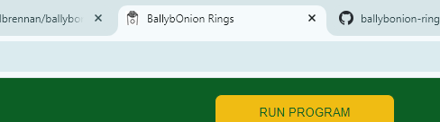

The browser tab features the name of the application. 

#### Interactivity

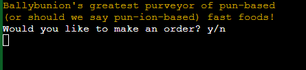

Throughout the application, the user can enter commands to navigate from one screen to another, order menu items, cancel items, etc. 

#### Text Styling

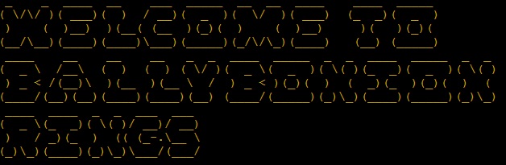

Pyfiglet is used throughout the application to add interest to the aesthetic of the site and contribute to a positive user experience. 

#### Text Colouring

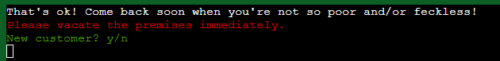

Colorama is used throughout the application to add variety and emphasis to the text as appropriate.  

#### Main Menu

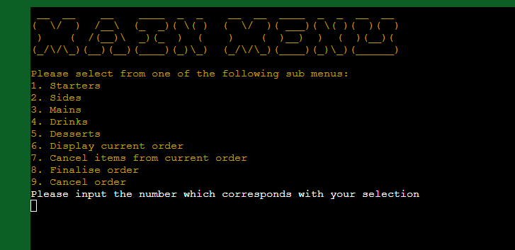

A main menu screen orients the user within the application. 

#### Starters Menu

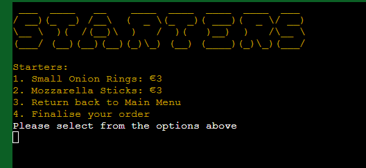

The starters menu allows the user to add starters to their order, return to the main menu or proceed directly to finalise their order. 

#### Sides, Mains, Drinks and Desserts Menu

Similar menus also exist for sides, mains, drinks and desserts.

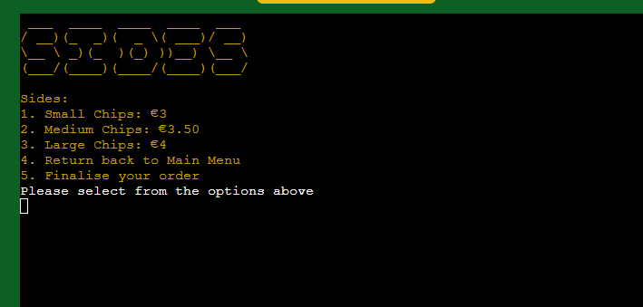

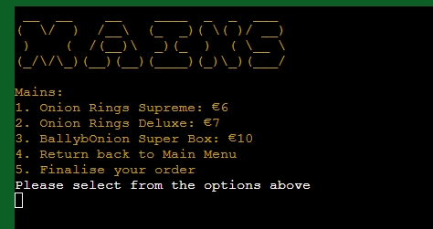

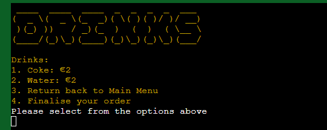

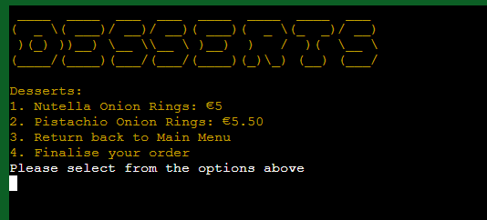

#### Display Order Menu

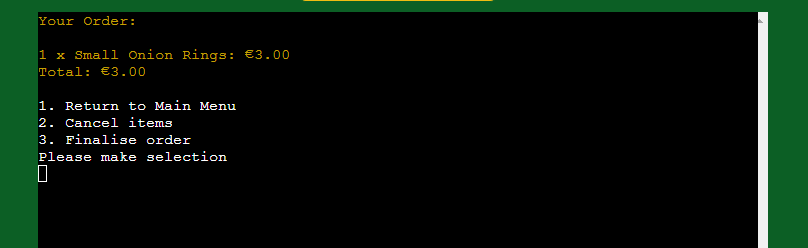

Pressing 6 on the main menu screen will bring the user to the Display Order Menu. 

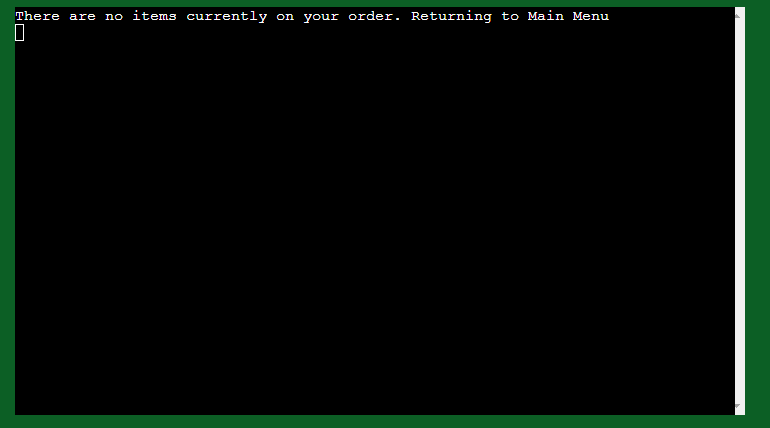

If the user has nothing ordered, the above message will appear for two seconds and then the user will be reverted back to the main menu. This functionality also exists for the Cancel Items and Finalise Order menus discussed below.

#### Cancel Items Menu

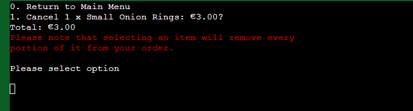

Pressing 7 on the main menu sends the user to this menu where they can remove items from their order. 

#### Finalise Order Menu

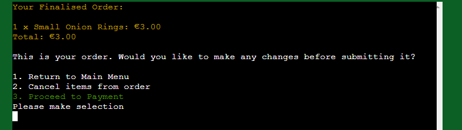

Pressing 8 on the main menu screen sends the user to this menu, where they can see they're order and decide whether or not to return to the main menu, cancel items or proceed to payment.

#### Cancel Order

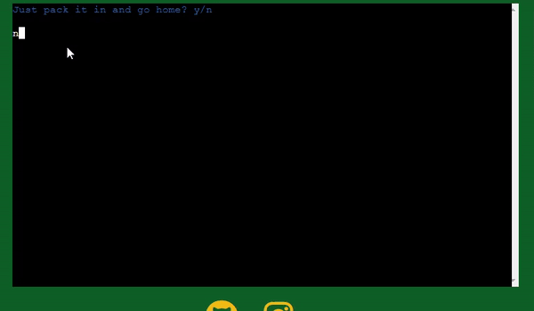

If the user wants to cancel their order altogether, they can press 9 on the main menu screen. If they type 'y', they're shown a brief 'come again soon' style message and the user is sent back to the Welcome Screen. If they type 'n', they're sent back to the Main Menu. 

#### Proceed to Payment

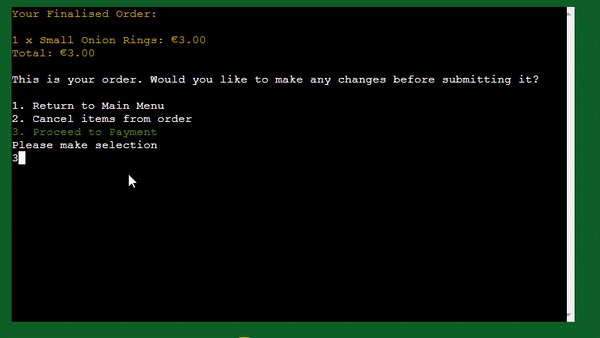

From the Finalise Order Menu, the user can type 3 to proceed to make a payment. The elipses animations emulate the real-world lag that accompanies card payments. The user is asked to input a four number pin code (any four single-digit numbers between 0 and 9). Upon inputting this code, the user is thanked for their custom, given a randomly-generated four-digit collection number for collecting their food from the counter, and then the user is sent back to the Welcome Menu. 

### Future Features

- Favicon
    - I was not able to add a favicon. From looking at Stack Overflow, it appears that this is a common issue when deploying apps through Heroku. In the future I will add this feature.
- Removing specific quantity of item
    - At the moment, the user can remove items from their order from the Cancel Items menu, however they can only remove all of a single item. If they have two BallybOnion Super Boxes ordered, for example, and they only wanted one, then they would have to cancel both boxes, then add another one afterwards. In the future, this will be amended so that users can be more precise in how many portions of an item they want to remove from their order. 

## Tools & Technologies Used

-  used to generate README and TESTING templates.
-  used for version control. (`git add`, `git commit`, `git push`)
-  used for secure online code storage.
-  used as a cloud-based IDE for development.
-  used for the main site content.
-  used for the main site design and layout.
-  used for user interaction on the site.
-  used as the back-end programming language.
-  used for hosting the deployed back-end site.
-  used for the icons.
-  used to help debug, troubleshoot, and explain things.

## Data Model

### Flowchart

To follow best practice, a flowchart was created for the app's logic,
and mapped out before coding began using a free version of
[Draw.io](https://www.draw.io).

Below is the flowchart of the main process of this Python program. While some features have been added since, the fundamental logic of the application remains relevant and apparent.

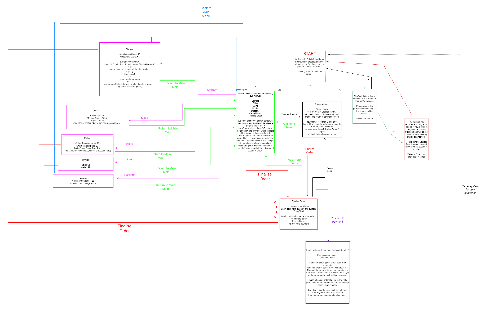

### Classes & Functions

The program uses object oriented programming in the form of the NewOrder Class. Instances of this class have the new_order property, which is a dictionary that contains every menu item as a key, with each corresponding value set to None. When a quantity of an item is ordered, the value of that item is changed through the add_item() method. 

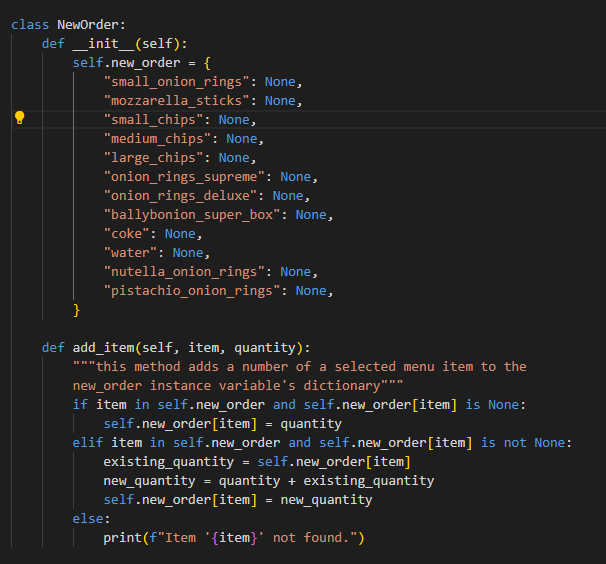

Before the startscreen() function is called, which starts the entire program, an instance of NewOrder is created and stored in the variable new_order. 

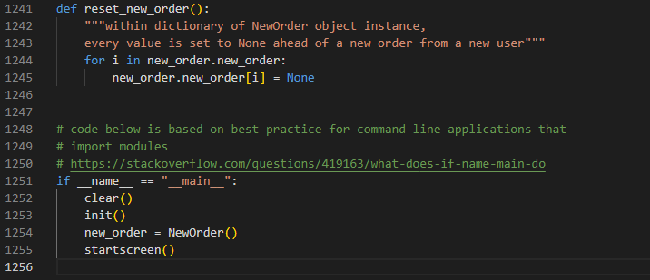

At the end of the process_payment() function, just before the user's interaction with this program/sales kiosk comes to an end, the reset_new_order() function is called. This iterates over new_order.new_order, setting the value of each key back to None before a new customer makes their own order.

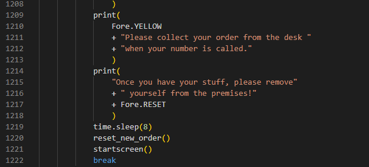

A variety of methods and functions are used throughout the application, such as starters_menu(), vacate_premises(), reset_new_order(), clear(), main_menu(), startscreen(),
re.match(), random.randint(), init(), process_payment(), etc etc. The application also utilises match conditional statements.

### Imports

I've used the following Python packages and/or external imported packages.

import time
import random
import os
import sys
import re
import pyfiglet
from colorama import init, Fore, Back

- `time` : sleep(seconds) method used throughout program 
- `random` : used for generation of collection number at end of process_payment() function
- `os` and `sys` : used for `clear()` function
- `re` : used for re.match() method for pin verification
- `colorama` : used for including color
- `pyfiglet` : used to stylise text 

I also installed [Black](https://pypi.org/project/black/) to help with formatting run.py to align with PEP 8 Style Guidelines.

## Testing

> [!NOTE]  
> For all testing, please refer to the [TESTING.md](TESTING.md) file.

## Deployment

Code Institute has provided a [template](https://github.com/Code-Institute-Org/python-essentials-template) to display the terminal view of this backend application in a modern web browser.
This is to improve the accessibility of the project to others.

The live deployed application can be found deployed on [Heroku](https://ballybonion-rings-709267bfe701.herokuapp.com).

### Heroku Deployment

This project uses [Heroku](https://www.heroku.com), a platform as a service (PaaS) that enables developers to build, run, and operate applications entirely in the cloud.

Deployment steps are as follows, after account setup:

- Select **New** in the top-right corner of your Heroku Dashboard, and select **Create new app** from the dropdown menu.
- Your app name must be unique, and then choose a region closest to you (EU or USA), and finally, select **Create App**.
- From the new app **Settings**, click **Reveal Config Vars**, and set the value of KEY to `PORT`, and the value to `8000` then select *add*.
- If using any confidential credentials, such as CREDS.JSON, then these should be pasted in the Config Variables as well.
- Further down, to support dependencies, select **Add Buildpack**.
- The order of the buildpacks is important, select `Python` first, then `Node.js` second. (if they are not in this order, you can drag them to rearrange them)

Heroku needs three additional files in order to deploy properly.

- requirements.txt
- Procfile
- runtime.txt

You can install this project's **requirements** (where applicable) using:

- `pip3 install -r requirements.txt`

If you have your own packages that have been installed, then the requirements file needs updated using:

- `pip3 freeze --local > requirements.txt`

The **Procfile** can be created with the following command:

- `echo web: node index.js > Procfile`

The **runtime.txt** file needs to know which Python version you're using:
1. type: `python3 --version` in the terminal.
2. in the **runtime.txt** file, add your Python version:
	- `python-3.9.19`

For Heroku deployment, follow these steps to connect your own GitHub repository to the newly created app:

Either:

- Select **Automatic Deployment** from the Heroku app.

Or:

- In the Terminal/CLI, connect to Heroku using this command: `heroku login -i`
- Set the remote for Heroku: `heroku git:remote -a app_name` (replace *app_name* with your app name)
- After performing the standard Git `add`, `commit`, and `push` to GitHub, you can now type:
	- `git push heroku main`

The frontend terminal should now be connected and deployed to Heroku!

### Local Deployment

This project can be cloned or forked in order to make a local copy on your own system.

For either method, you will need to install any applicable packages found within the *requirements.txt* file.

- `pip3 install -r requirements.txt`.

If using any confidential credentials, such as `CREDS.json` or `env.py` data, these will need to be manually added to your own newly created project as well.

#### Cloning

You can clone the repository by following these steps:

1. Go to the [GitHub repository](https://github.com/cthlbrennan/ballybonion-rings) 
2. Locate the Code button above the list of files and click it 
3. Select if you prefer to clone using HTTPS, SSH, or GitHub CLI and click the copy button to copy the URL to your clipboard
4. Open Git Bash or Terminal
5. Change the current working directory to the one where you want the cloned directory
6. In your IDE Terminal, type the following command to clone my repository:
	- `git clone https://github.com/cthlbrennan/ballybonion-rings.git`
7. Press Enter to create your local clone.

Alternatively, if using Gitpod, you can click below to create your own workspace using this repository.

Please note that in order to directly open the project in Gitpod, you need to have the browser extension installed.
A tutorial on how to do that can be found [here](https://www.gitpod.io/docs/configure/user-settings/browser-extension).

#### Forking

By forking the GitHub Repository, we make a copy of the original repository on our GitHub account to view and/or make changes without affecting the original owner's repository.
You can fork this repository by using the following steps:

1. Log in to GitHub and locate the [GitHub Repository](https://github.com/cthlbrennan/ballybonion-rings)
2. At the top of the Repository (not top of page) just above the "Settings" Button on the menu, locate the "Fork" Button.
3. Once clicked, you should now have a copy of the original repository in your own GitHub account!

### Local VS Deployment

There are no differences between the local version and the deployed live version on Heroku.

## Credits

### Content

| Source | Location | Notes |
| --- | --- | --- |
| [Markdown Builder](https://tim.2bn.dev/markdown-builder) | README and TESTING | tool to help generate the Markdown files |
| [Code Institute](codeinstitute.net) | Entire Site | Some stucture and code taken from Love Sandwiches Walkthrough Project and Python Essentials Module |
| [Viacheslav1510's PP3, shown in class](https://github.com/Code-Institute-Submissions/CI_PP3_Coffee_Machine/blob/main/views/index.html) | HTML and CSS Styling | Use of flexbox, social media icons and colour styling|
|[Harvard's CS50P Course, specifically this lecture on regex](https://www.youtube.com/watch?v=hy3sd9MOAcc&t=1s) | run.py | Use of re.match() |
|[Geeks for Geeks article about Pyfiglet](https://www.geeksforgeeks.org/python-ascii-art-using-pyfiglet-module/) | run.py | Importing and using Pyfiglet module|
|[Geeks for Geeks article about Colorama](https://www.geeksforgeeks.org/print-colors-python-terminal/) | run.py | Use of Colorama |
|[PEPS article about conventions for using constants](https://peps.python.org/pep-0008/#constants) | run.py | Constants must be capitalised |
|[Geeks for Geeks article about how to clear a terminal of text](https://www.geeksforgeeks.org/clear-screen-python/) | run.py | import sys and os built in modules to create clear() function |
|[Harvard CS50P video](https://www.youtube.com/watch?v=_b6NgY_pMdw) | run.py | Use of match conditional statements |
|Code Institute's Python Essentials module | run.py | Use of Try and Except keywords for error handling |
|[Geeks for Geeks](https://www.geeksforgeeks.org/iterate-python-dictionary/) | run.py, cancel_items() function | How to iterate over a dictionary |
|[Geeks for Geeks](https://www.geeksforgeeks.org/python-filter-non-none-dictionary-keys/) | run.py, remove_items() function | Code template for iterating through dictionaries and filtering out keys without None values |
|[W3Schools](https://www.w3schools.com/python/python_lists_comprehension.asp) | run.py | List comprehension used in remove_items() function |
|[Stack Overflow](https://stackoverflow.com/questions/419163/what-does-if-name-main-do) | run.py | best practice for command line applications that import modules |

### Media

| Source | Location | Type | Notes |
| --- | --- | --- | --- |
| [Font Awesome](https://fontawesome.com) | entire site | image | Social media link icons in footer |

### Acknowledgements

Thanks to Tim Nelson for his help and guidance. 
Thanks to Marko Tot for same. 