# Testing

> [!NOTE]  
> Return back to the [README.md](README.md) file.

## Code Validation

### Python

I have used the recommended [PEP8 CI Python Linter](https://pep8ci.herokuapp.com) to validate run.py.

| File | CI URL | Screenshot |
| --- | --- | --- | 
| run.py | [PEP8 CI](https://pep8ci.herokuapp.com/https://raw.githubusercontent.com/cthlbrennan/ballybonion-rings/main/run.py) | 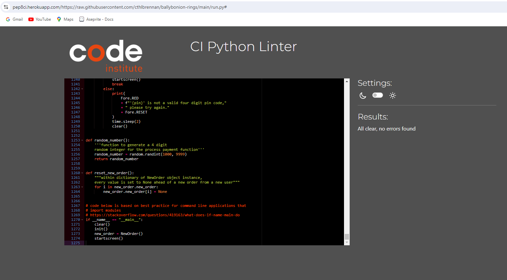 | 

## Browser Compatibility

The compatibility of both pages of the website have been tested on different browsers including Google Chrome, Microsoft Edge and Mozilla Firefox. 

 Click here to see Compatibility with Google Chrome 

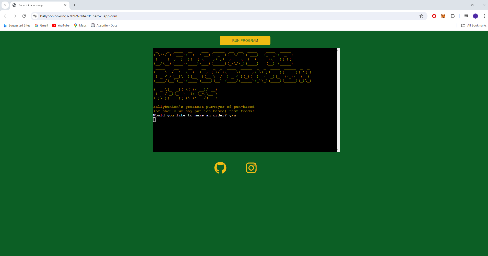

 Click here to see Compatibility with Mozilla Firefox 

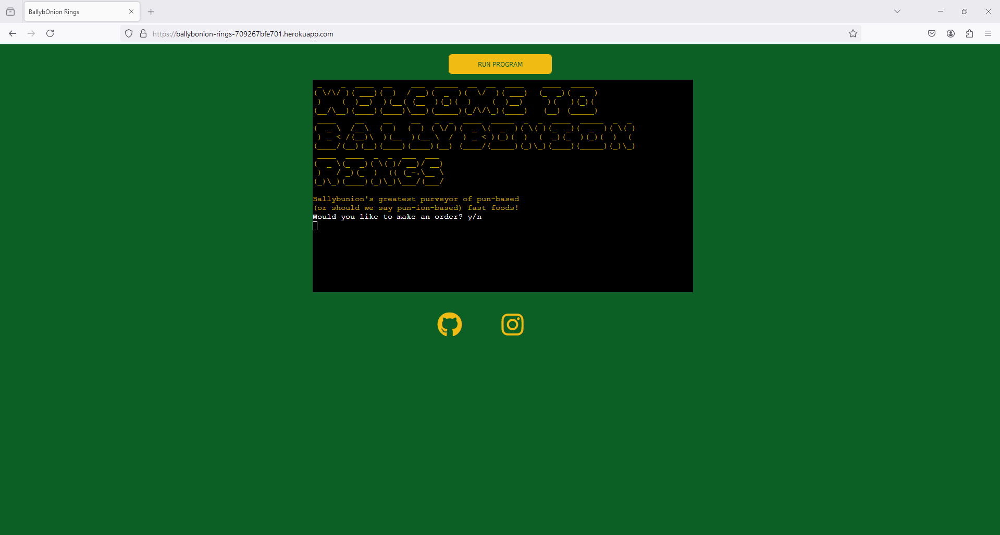

 Click here to see Compatibility with Microsoft Edge 

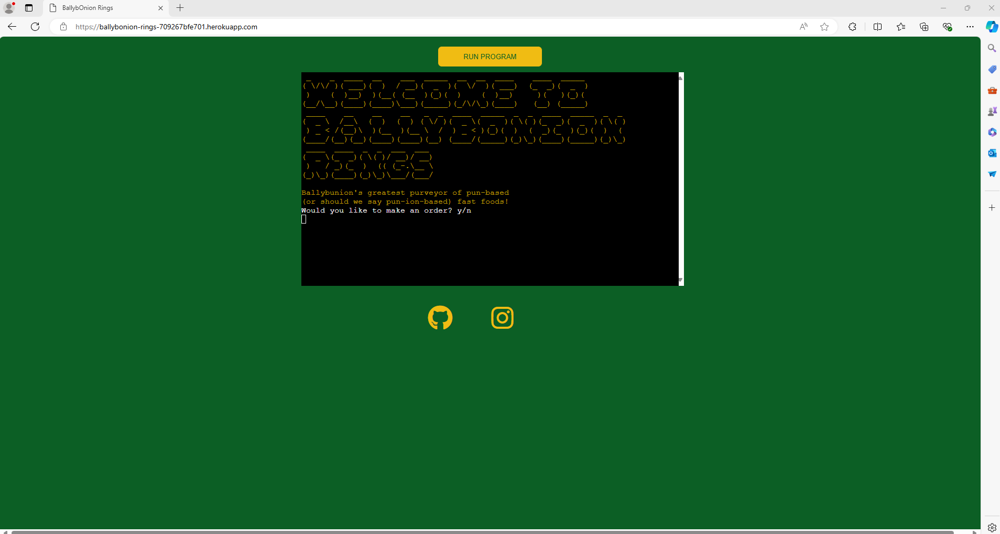

It is evident that the website is compatible with multiple browsers.

## Responsiveness

As can be seen below, the application responds well when tested on different device sizes. For mobile devices, functionality would not be ideal in portrait view - however, landscape orientation would overcome any potential issues. As responsiveness is not a priority for PP3, I did not give this aspect of my project much attention. 

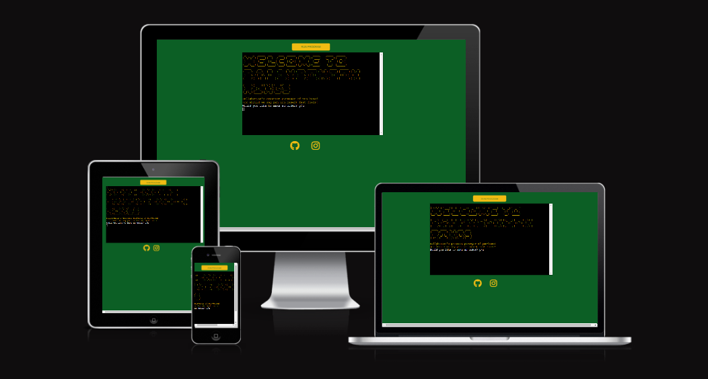

## Lighthouse Audit

I've tested my deployed project using the Lighthouse Audit tool to check for any major issues.

| Mobile | Desktop | Notes |
| --- | --- | --- |
| 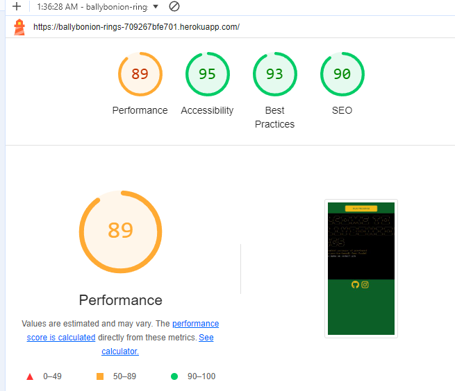 | 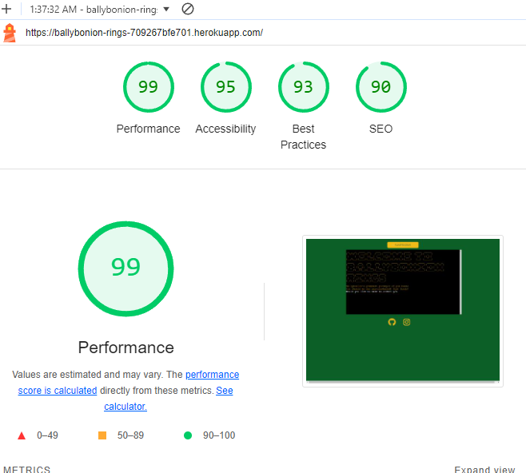 | Good performance on mobile and desktop |

## User Story Testing

| User Story | Screenshot |
| --- | --- |
| As a user, I would like to easily navigate the menu of the restaurant, so that I can make an informed decision about my order. | |
| As a user, I would like to have the ability to change my order, in case I order the wrong item my mistake. |  |
| As a user, I would like to get a collection number at the end of my order, so that I can collect my food from the counter when it's ready.| 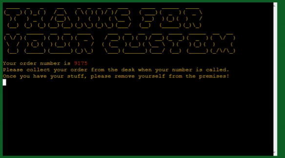 |

## Defensive Programming

Defensive programming was manually tested with the below user acceptance testing:

| Expectation | Test | Result | Fix | Screenshot |
| --- | --- | --- | --- | --- |
| Entering 'y' on Welcome Screen will lead to Main Menu screen | Tested the feature by entering 'y' | The feature behaved as expected | Test concluded and passed | 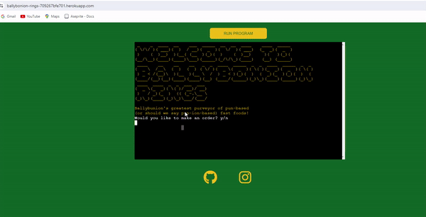 |
| Entering 'n' on Welcome Screen will trigger not_make_order function/screen | Tested the feature by entering 'n' | The feature behaved as expected | Test concluded and passed | 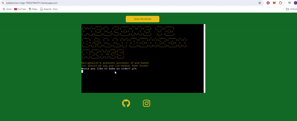 |
| Entering 'N' on Welcome Screen will trigger not_make_order function/screen | Tested the feature by entering 'N' | The feature behaved as expected | Test concluded and passed | 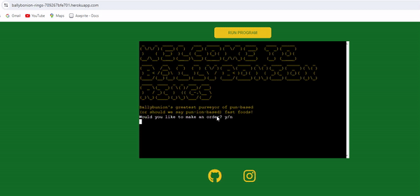 |
| Entering 'Y' on Welcome Screen will lead to Main Menu screen | Tested the feature by entering 'Y' | The feature behaved as expected | Test concluded and passed | 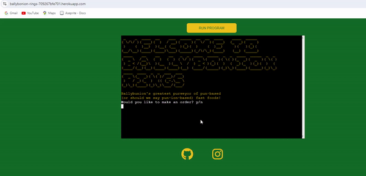 |
| Entering intentionally invalid inputs on Welcome Screen will result in error handling messages, program won't crash | Tested the feature by entering characters such as '!', '1', '-1', '', ' ', 'dkdk' | The feature behaved as expected | Test concluded and passed | 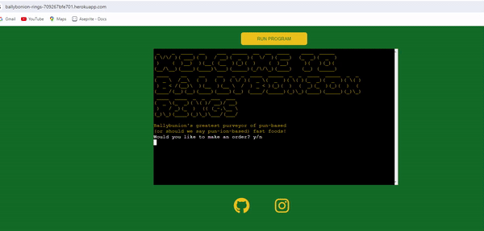 |
| Clicking 'Run Program' button will reload the whole program | Tested the feature by clicking on button | The feature behaved as expected | Test concluded and passed | 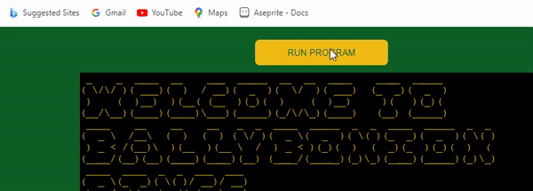 |
| Clicking social media links in footer will open pages in new tabs | Tested the feature by clicking on social media links | The features behaved as expected | Test concluded and passed |  |
| Entering 'y' on new customer screen will lead back to Welcome Screen | Tested the feature by entering 'y' | The feature behaved as expected | Test concluded and passed | 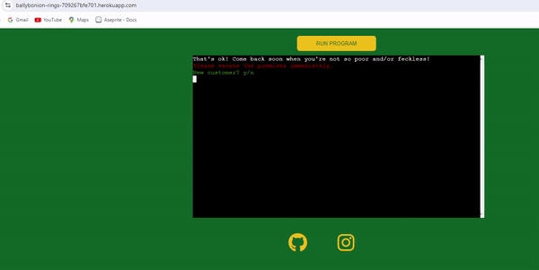 |
| Entering 'n' on new customer screen will lead to Vacate Premises Screen | Tested the feature by entering 'n' | The feature behaved as expected | Test concluded and passed | 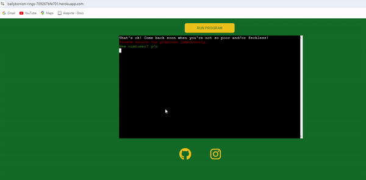 |
| Trying 'Y' and 'N' on new customer screen will lead to same results as lowercase equivalents | Tested by entering 'Y' and 'N' | The feature behaved as expected | Test concluded and passed | 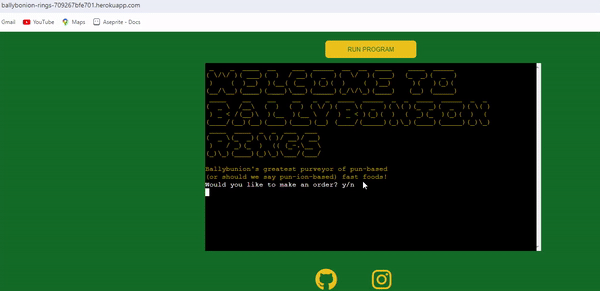 |
| Entering intentionally invalid inputs on new customer screen will result in error handling messages, program won't crash | Tested by entering characters such as '!', '1', '-1', '', ' ', 'dkdk' | The feature behaved as expected | Test concluded and passed | 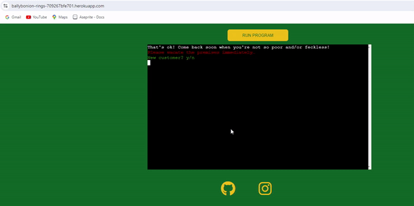 |
| Testing each valid input on Main Menu screen will lead to its respective sub menu | Tested the feature by entering 1-9 | The feature behaved as expected | Test concluded and passed | 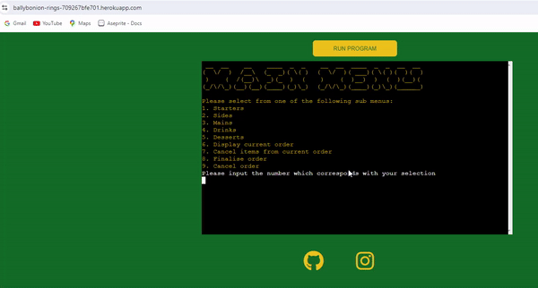 |
| Entering intentionally invalid inputs on Main Menu screen will not crash program | Tested the feature by entering characters such as "!", '1', '-1', '', ' ', 'dkdk' | The feature behaved as expected | Test concluded and passed | 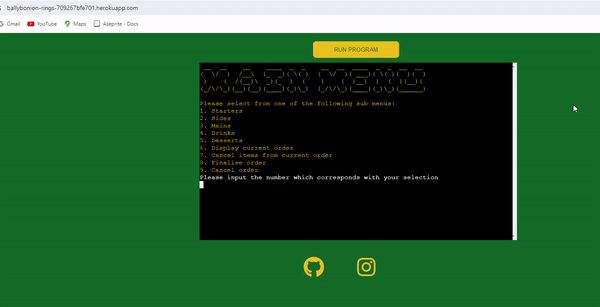 |
| Testing each valid input on Starters Menu screen, each option will function as expected | Tested the feature by entering 1-4 | The feature behaved as expected | Test concluded and passed | 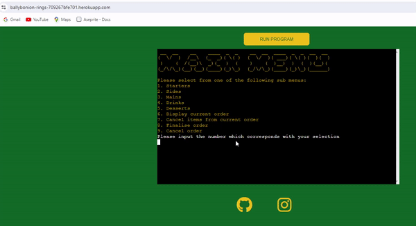 |
| Entering intentionally invalid inputs on Starters Menu screen will not crash program | Tested the feature by entering characters such as "!", '1', '-1', '', ' ', 'dkdk' | The feature behaved as expected | Test concluded and passed | 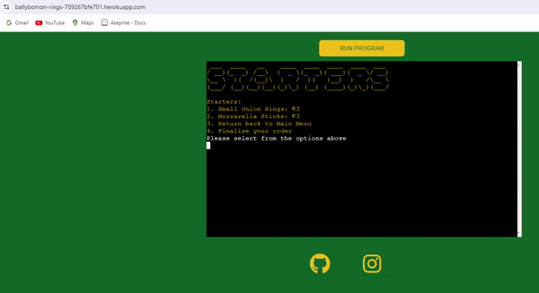 |
| Testing each valid input on Sides Menu screen, each option will function as expected | Tested the feature by entering 1-5 | The feature behaved as expected | Test concluded and passed | 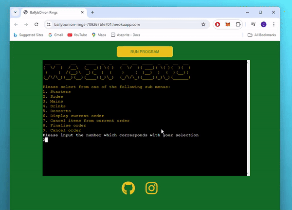 |
| Entering intentionally invalid inputs on Sides Menu screen will not crash program | Tested the feature by entering characters such as "!", '1', '-1', '', ' ', 'dkdk' | The feature behaved as expected | Test concluded and passed | 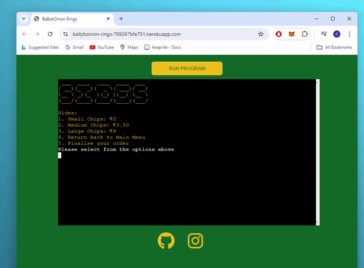 |
| Testing each valid input on Mains Menu screen, each option will function as expected | Tested the feature by entering 1-5 | The feature behaved as expected | Test concluded and passed |  |
| Entering intentionally invalid inputs on Mains Menu screen will not crash program | Tested the feature by entering characters such as "!", '1', '-1', '', ' ', 'dkdk' | The feature behaved as expected | Test concluded and passed | 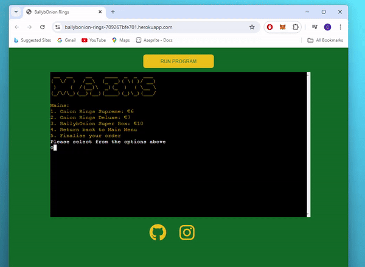 |
| Testing each valid input on Drinks Menu screen, each option will function as expected | Tested the feature by entering 1-4 | The feature behaved as expected | Test concluded and passed | 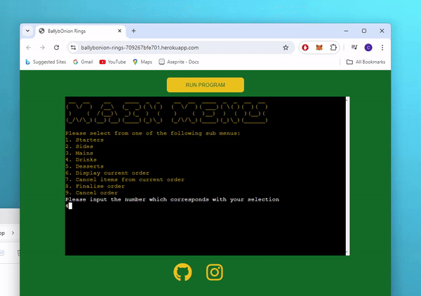 |
| Entering intentionally invalid inputs on Drinks Menu screen will not crash program | Tested the feature by entering characters such as "!", '1', '-1', '', ' ', 'dkdk' | The feature behaved as expected | Test concluded and passed | 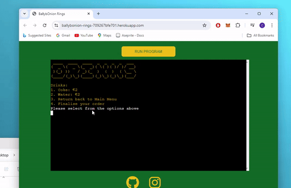 |
| Testing each valid input on Desserts Menu screen, each option will function as expected | Tested the feature by entering 1-4 | The feature behaved as expected | Test concluded and passed | 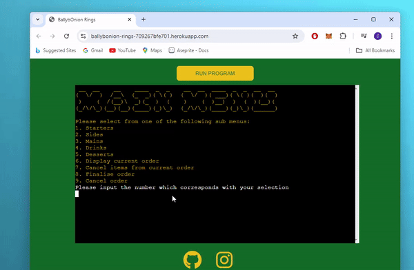 |
| Entering intentionally invalid inputs on Desserts Menu screen will not crash program | Tested the feature by entering characters such as "!", '1', '-1', '', ' ', 'dkdk' | The feature behaved as expected | Test concluded and passed | 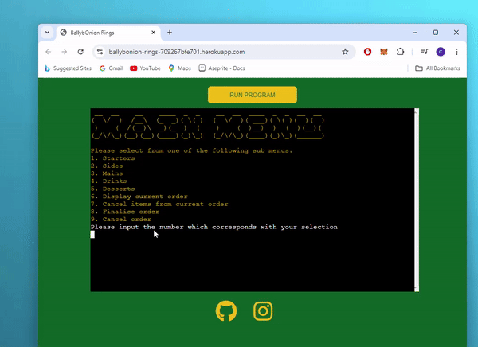 |
| When Display Order Menu option is selected without any items ordered, user will be returned to Main Menu automatically. If the user has ordered something and then selects Display Order Menu, they will be shown three options. Upon entering the valid inputs on the Display Order Menu screen, each option will function as expected | Test Display Order Menu option without having ordered a menu item, then test it after ordering something. Then test each of the valid options by entering 1-3 | The features behaved as expected | Test concluded and passed | 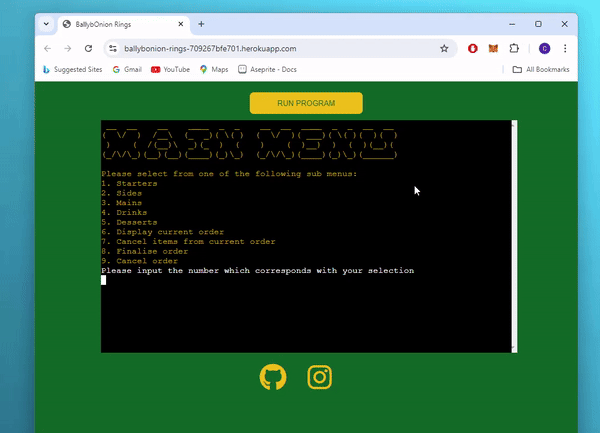 |
| Entering intentionally invalid inputs on Display Order screen will not crash program | Tested the feature by entering characters such as "!", '1', '-1', '', ' ', 'dkdk' | The feature behaved as expected | Test concluded and passed | 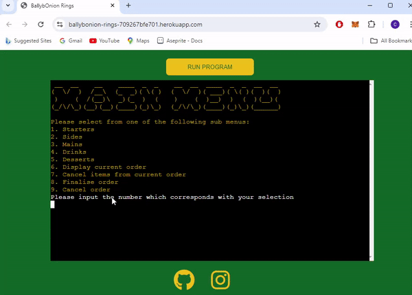 |
| When Cancel Items option is selected without any items ordered, user will be returned to Main Menu automatically. If the user has ordered something and then selects Cancel Items Menu, they will be shown an option to remove each ordered item, as well as '0. Return to Main Menu'. Upon entering the valid inputs on the Cancel Items menu screen, each option will function as expected | Test Cancel Items menu without having ordered a menu item, then test it after ordering something. Then test each of the valid options | The features behaved as expected | Test concluded and passed | 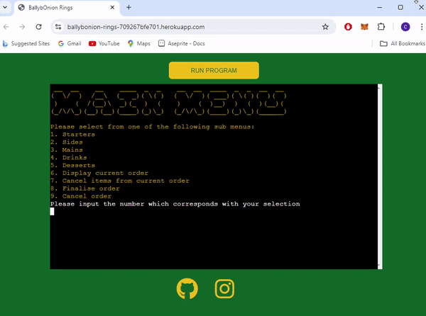 |
| Entering intentionally invalid inputs on Cancel Item screen will not crash program | Tested the feature by entering characters such as "!", '1', '-1', '', ' ', 'dkdk' | The feature behaved as expected | Test concluded and passed | 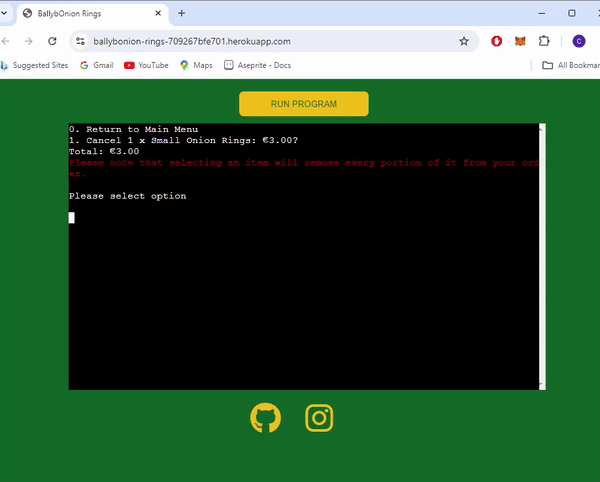 |
| Testing each valid input on Cancel Order screen, each option will function as expected | Tested the feature by entering 'y', 'Y', 'n', 'N' | The feature behaved as expected | Test concluded and passed | 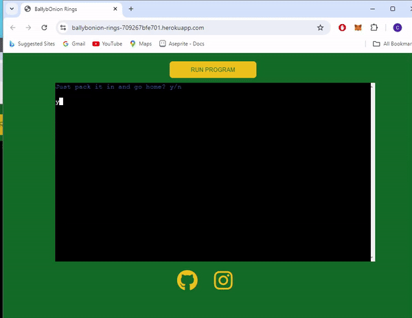 |
| Entering intentionally invalid inputs on Cancel Order screen will not crash program | Tested the feature by entering characters such as "!", '1', '-1', '', ' ', 'dkdk' | The feature behaved as expected | Test concluded and passed | 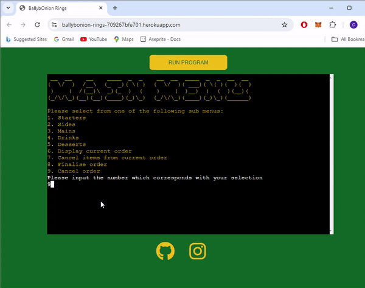 |
| Testing each valid input on Finalise Order screen, each option will function as expected | Tested the feature by entering 1-3 | The feature behaved as expected | Test concluded and passed | 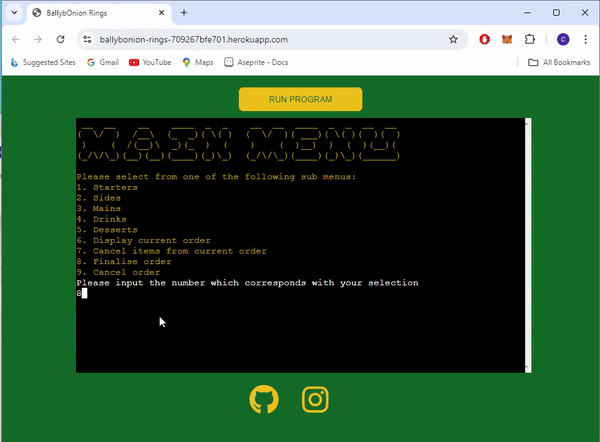 |
| Entering intentionally invalid inputs on Finalise Order screen will not crash program | Tested the feature by entering characters such as "!", '1', '-1', '', ' ', 'dkdk' | The feature behaved as expected | Test concluded and passed | 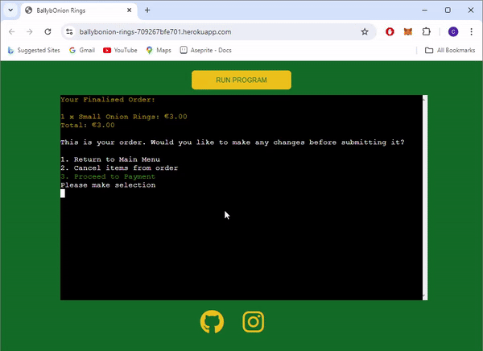 |
| Testing pin code on process payment screen | Tested the feature by entering any sequence of four digits between 0 and 9 inclusive | The feature behaved as expected | Test concluded and passed | 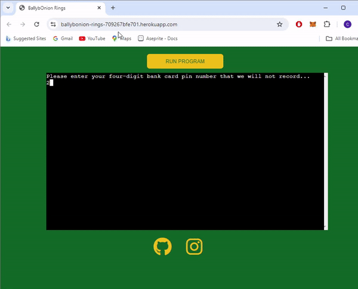 |
| Entering intentionally invalid inputs on pin code screen will not crash program | Tested the feature by entering characters such as "!", '1', '-1', '', ' ', 'dkdk' | The feature behaved as expected | Test concluded and passed | 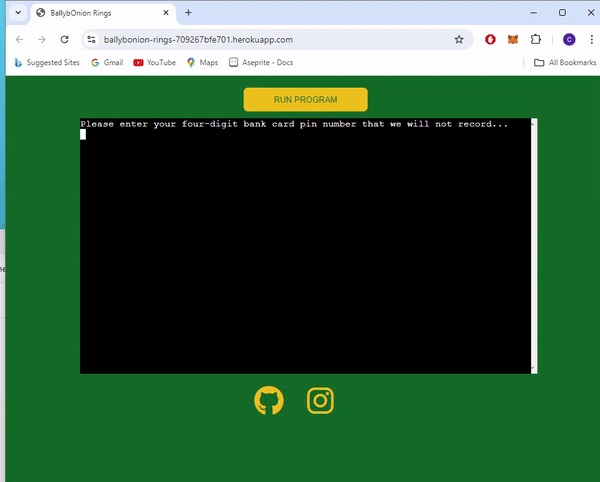 |

## Bugs

### 1 - Animation Loop not appearing on main menu

Upon landing on the main menu, the cross animation wasn't visible, even though the keyframe, animation style property, and file path were all apparently correct. 

However, after some time, I realised that the animation shorthand property actually was incorrect - instead of saying '0.1s' as required, I needed to say '1.0s' - this value can't just be a floating point, there needs to be a number before the floating point for the property to work properly.

This was later changed to 3s, as the animation was much too fast at 0.1s. 

## Unfixed Bugs

During my time working on this project, I have noticed that there was a problem raised within my IDE. 

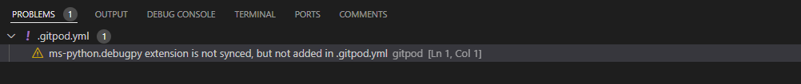

Having done some research on Stack Overflow, Google, Phind, etc, I believe that this bug may relate to the recent Gitpod migration process that Code Institute has carried out. In any case, it does not seem to have any bearing on the operation of my website, so I have left this bug unaddressed for now. 

The second unfixed bug is not consistent. Rarely, the use of the key 'small-onion-rings' will not correspond with its corresponding value, whether it's in relation to the dictionary within the new_order.new_order property of the object instantiation, the NAMES dictionary or the PRICES dictionary. The behaviour is inconsistent, unreplicable, and only occurs very rarely.

If I was to make an educated guess, I would assert that the use of the same word as a key across multiple dictionaries could result in this buggy behaviour. In the future, I will aim to have more differentiation. 

There are no other remaining bugs that I am aware of.