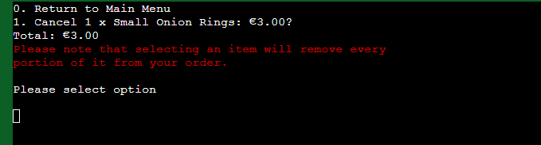

# Testing

> [!NOTE]  
> Return back to the [README.md](README.md) file.

## Code Validation

### Python

I have used the recommended [PEP8 CI Python Linter](https://pep8ci.herokuapp.com) to validate run.py.

| File | CI URL | Screenshot |
| --- | --- | --- | 
| run.py | [PEP8 CI](https://pep8ci.herokuapp.com/https://raw.githubusercontent.com/cthlbrennan/ballybonion-rings/main/run.py) |  | 

## Browser Compatibility

The compatibility of both pages of the website have been tested on different browsers including Google Chrome, Microsoft Edge and Mozilla Firefox. 

 Click here to see Compatibility with Google Chrome 

 Click here to see Compatibility with Mozilla Firefox 

 Click here to see Compatibility with Microsoft Edge 

It is evident that the website is compatible with multiple browsers.

## Responsiveness

As can be seen below, the application responds well when tested on different device sizes. For mobile devices, functionality would not be ideal in portrait view - however, landscape orientation would overcome any potential issues. As responsiveness is not a priority for PP3, I did not give this aspect of my project much attention. 

## Lighthouse Audit

I've tested my deployed project using the Lighthouse Audit tool to check for any major issues.

| Mobile | Desktop | Notes |
| --- | --- | --- |
|  |  | Good performance on mobile and desktop |

## User Story Testing

| User Story | Screenshot |
| --- | --- |
| As a user, I would like to easily navigate the menu of the restaurant, so that I can make an informed decision about my order. | |
| As a user, I would like to have the ability to change my order, in case I order the wrong item my mistake. |  |
| As a user, I would like to get a collection number at the end of my order, so that I can collect my food from the counter when it's ready.|  |

## Defensive Programming

Defensive programming was manually tested with the below user acceptance testing:

| Page | Expectation | Test | Result | Fix | Screenshot |
| --- | --- | --- | --- | --- | --- |
| Home | | | | | |
| | Feature is expected to do X when the user does Y | Tested the feature by doing Y | The feature behaved as expected, and it did Y | Test concluded and passed |  |
| | Feature is expected to do X when the user does Y | Tested the feature by doing Y | The feature did not respond to A, B, or C. | I did Z to the code because something was missing |  |
| About | | | | | |
| | Feature is expected to do X when the user does Y | Tested the feature by doing Y | The feature behaved as expected, and it did Y | Test concluded and passed |  |
| | Feature is expected to do X when the user does Y | Tested the feature by doing Y | The feature did not respond to A, B, or C. | I did Z to the code because something was missing |  |
| Gallery | | | | | |
| | Feature is expected to do X when the user does Y | Tested the feature by doing Y | The feature behaved as expected, and it did Y | Test concluded and passed |  |
| | Feature is expected to do X when the user does Y | Tested the feature by doing Y | The feature did not respond to A, B, or C. | I did Z to the code because something was missing |  |
| Contact | | | | | |
| | Feature is expected to do X when the user does Y | Tested the feature by doing Y | The feature behaved as expected, and it did Y | Test concluded and passed |  |
| | Feature is expected to do X when the user does Y | Tested the feature by doing Y | The feature did not respond to A, B, or C. | I did Z to the code because something was missing |  |
| repeat for all remaining pages | x | x | x | x | x |

## Bugs

## Unfixed Bugs

During my time working on this project, I have noticed that there was a problem raised within my IDE. 

Having done some research on Stack Overflow, Google, Phind, etc, I believe that this bug may relate to the recent Gitpod migration process that Code Institute has carried out. In any case, it does not seem to have any bearing on the operation of my website, so I have left this bug unaddressed for now. 

The second unfixed bug is not consistent. Rarely, the use of the key 'small-onion-rings' will not correspond with its corresponding value, whether it's in relation to the dictionary within the new_order.new_order property of the object instantiation, the NAMES dictionary or the PRICES dictionary. The behaviour is inconsistent, unreplicable, and only occurs very rarely.

If I was to make an educated guess, I would assert that the use of the same word as a key across multiple dictionaries could result in this buggy behaviour. In the future, I will aim to have more differentiation. 

> [!NOTE]  
> There are no other remaining bugs that I am aware of.