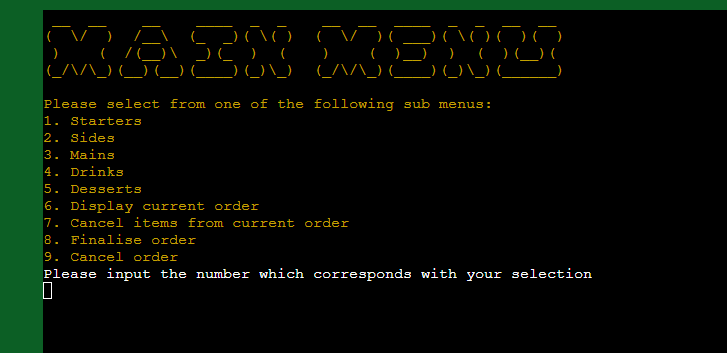
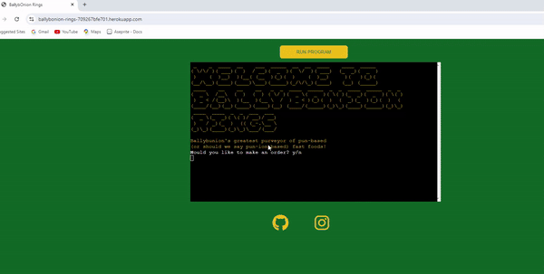
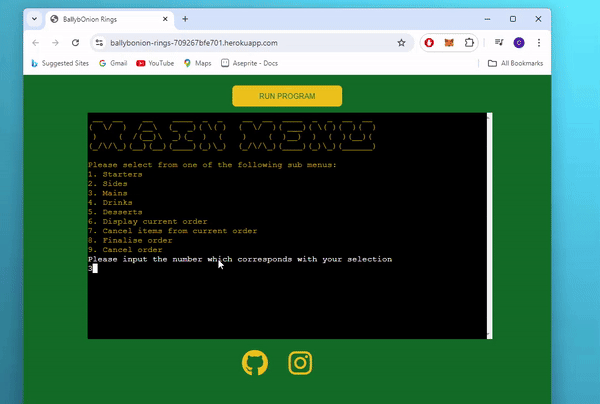

# Testing

> [!NOTE]  
> Return back to the [README.md](README.md) file.

## Code Validation

### Python

I have used the recommended [PEP8 CI Python Linter](https://pep8ci.herokuapp.com) to validate run.py.

| File | CI URL | Screenshot |
| --- | --- | --- | 
| run.py | [PEP8 CI](https://pep8ci.herokuapp.com/https://raw.githubusercontent.com/cthlbrennan/ballybonion-rings/main/run.py) |  | 

## Browser Compatibility

The compatibility of both pages of the website have been tested on different browsers including Google Chrome, Microsoft Edge and Mozilla Firefox. 

 Click here to see Compatibility with Google Chrome 

 Click here to see Compatibility with Mozilla Firefox 

 Click here to see Compatibility with Microsoft Edge 

It is evident that the website is compatible with multiple browsers.

## Responsiveness

As can be seen below, the application responds well when tested on different device sizes. For mobile devices, functionality would not be ideal in portrait view - however, landscape orientation would overcome any potential issues. As responsiveness is not a priority for PP3, I did not give this aspect of my project much attention. 

## Lighthouse Audit

I've tested my deployed project using the Lighthouse Audit tool to check for any major issues.

| Mobile | Desktop | Notes |
| --- | --- | --- |
|  |  | Good performance on mobile and desktop |

## User Story Testing

| User Story | Screenshot |
| --- | --- |
| As a user, I would like to easily navigate the menu of the restaurant, so that I can make an informed decision about my order. | |
| As a user, I would like to have the ability to change my order, in case I order the wrong item my mistake. |  |
| As a user, I would like to get a collection number at the end of my order, so that I can collect my food from the counter when it's ready.|  |

## Defensive Programming

Defensive programming was manually tested with the below user acceptance testing:

| Expectation | Test | Result | Fix | Screenshot |
| --- | --- | --- | --- | --- |
| Entering 'y' on Welcome Screen will lead to Main Menu screen | Tested the feature by entering 'y' | The feature behaved as expected | Test concluded and passed |  |
| Entering 'n' on Welcome Screen will trigger not_make_order function/screen | Tested the feature by entering 'n' | The feature behaved as expected | Test concluded and passed |  |
| Entering 'N' on Welcome Screen will trigger not_make_order function/screen | Tested the feature by entering 'N' | The feature behaved as expected | Test concluded and passed |  |
| Entering 'Y' on Welcome Screen will lead to Main Menu screen | Tested the feature by entering 'Y' | The feature behaved as expected | Test concluded and passed |  |
| Entering intentionally invalid inputs on Welcome Screen will result in error handling messages, program won't crash | Tested the feature by entering characters such as '!', '1', '-1', '', ' ', 'dkdk' | The feature behaved as expected | Test concluded and passed |  |
| Clicking 'Run Program' button will reload the whole program | Tested the feature by clicking on button | The feature behaved as expected | Test concluded and passed |  |
| Clicking social media links in footer will open pages in new tabs | Tested the feature by clicking on social media links | The features behaved as expected | Test concluded and passed |  |
| Entering 'y' on new customer screen will lead back to Welcome Screen | Tested the feature by entering 'y' | The feature behaved as expected | Test concluded and passed |  |
| Entering 'n' on new customer screen will lead to Vacate Premises Screen | Tested the feature by entering 'n' | The feature behaved as expected | Test concluded and passed |  |
| Trying 'Y' and 'N' on new customer screen will lead to same results as lowercase equivalents | Tested by entering 'Y' and 'N' | The feature behaved as expected | Test concluded and passed |  |
| Entering intentionally invalid inputs on new customer screen will result in error handling messages, program won't crash | Tested by entering characters such as '!', '1', '-1', '', ' ', 'dkdk' | The feature behaved as expected | Test concluded and passed |  |
| Testing each valid input on Main Menu screen will lead to its respective sub menu | Tested the feature by entering 1-9 | The feature behaved as expected | Test concluded and passed |  |
| Entering intentionally invalid inputs on Main Menu screen will not crash program | Tested the feature by entering characters such as "!", '1', '-1', '', ' ', 'dkdk' | The feature behaved as expected | Test concluded and passed |  |
| Testing each valid input on Starters Menu screen, each option will function as expected | Tested the feature by entering 1-4 | The feature behaved as expected | Test concluded and passed |  |
| Entering intentionally invalid inputs on Starters Menu screen will not crash program | Tested the feature by entering characters such as "!", '1', '-1', '', ' ', 'dkdk' | The feature behaved as expected | Test concluded and passed |  |
| Testing each valid input on Sides Menu screen, each option will function as expected | Tested the feature by entering 1-5 | The feature behaved as expected | Test concluded and passed |  |
| Entering intentionally invalid inputs on Sides Menu screen will not crash program | Tested the feature by entering characters such as "!", '1', '-1', '', ' ', 'dkdk' | The feature behaved as expected | Test concluded and passed |  |
| Testing each valid input on Mains Menu screen, each option will function as expected | Tested the feature by entering 1-5 | The feature behaved as expected | Test concluded and passed |  |
| Entering intentionally invalid inputs on Mains Menu screen will not crash program | Tested the feature by entering characters such as "!", '1', '-1', '', ' ', 'dkdk' | The feature behaved as expected | Test concluded and passed |  |
| Testing each valid input on Drinks Menu screen, each option will function as expected | Tested the feature by entering 1-4 | The feature behaved as expected | Test concluded and passed |  |
| Entering intentionally invalid inputs on Drinks Menu screen will not crash program | Tested the feature by entering characters such as "!", '1', '-1', '', ' ', 'dkdk' | The feature behaved as expected | Test concluded and passed |  |
| Testing each valid input on Desserts Menu screen, each option will function as expected | Tested the feature by entering 1-4 | The feature behaved as expected | Test concluded and passed |  |
| Entering intentionally invalid inputs on Desserts Menu screen will not crash program | Tested the feature by entering characters such as "!", '1', '-1', '', ' ', 'dkdk' | The feature behaved as expected | Test concluded and passed |  |
| When Display Order Menu option is selected without any items ordered, user will be returned to Main Menu automatically. If the user has ordered something and then selects Display Order Menu, they will be shown three options. Upon entering the valid inputs on the Display Order Menu screen, each option will function as expected | Test Display Order Menu option without having ordered a menu item, then test it after ordering something. Then test each of the valid options by entering 1-3 | The features behaved as expected | Test concluded and passed |  |
| Entering intentionally invalid inputs on Display Order screen will not crash program | Tested the feature by entering characters such as "!", '1', '-1', '', ' ', 'dkdk' | The feature behaved as expected | Test concluded and passed |  |
| When Cancel Items option is selected without any items ordered, user will be returned to Main Menu automatically. If the user has ordered something and then selects Cancel Items Menu, they will be shown an option to remove each ordered item, as well as '0. Return to Main Menu'. Upon entering the valid inputs on the Cancel Items menu screen, each option will function as expected | Test Cancel Items menu without having ordered a menu item, then test it after ordering something. Then test each of the valid options | The features behaved as expected | Test concluded and passed |  |
| Entering intentionally invalid inputs on Cancel Item screen will not crash program | Tested the feature by entering characters such as "!", '1', '-1', '', ' ', 'dkdk' | The feature behaved as expected | Test concluded and passed |  |
| Testing each valid input on Cancel Order screen, each option will function as expected | Tested the feature by entering 'y', 'Y', 'n', 'N' | The feature behaved as expected | Test concluded and passed |  |
| Entering intentionally invalid inputs on Cancel Order screen will not crash program | Tested the feature by entering characters such as "!", '1', '-1', '', ' ', 'dkdk' | The feature behaved as expected | Test concluded and passed |  |
| Testing each valid input on Finalise Order screen, each option will function as expected | Tested the feature by entering 1-3 | The feature behaved as expected | Test concluded and passed |  |
| Entering intentionally invalid inputs on Finalise Order screen will not crash program | Tested the feature by entering characters such as "!", '1', '-1', '', ' ', 'dkdk' | The feature behaved as expected | Test concluded and passed |  |
| Testing pin code on process payment screen | Tested the feature by entering any sequence of four digits between 0 and 9 inclusive | The feature behaved as expected | Test concluded and passed |  |
| Entering intentionally invalid inputs on pin code screen will not crash program | Tested the feature by entering characters such as "!", '1', '-1', '', ' ', 'dkdk' | The feature behaved as expected | Test concluded and passed |  |

## Bugs

### 1 - Starters Menu Error Handling 

The code for the starters menu was originally as shown below:

Even though there was an if/else statement, if an adversarial input such 'gggg' was inputted for the "How Many?" prompt, the program would break before the else statement would have a chance to be implemented.

However, I implemented the Try and Except keywords correctly as per the Python Essentials module.

With this additional code, invalid inputs were caught and error handling was in place.

### 2 - Main Menu options not appearing aftering Welcome Menu 

The main menu options would not appear after entering 'y'/'Y' at the Welcome Menu.

This issue was resolved by removing the additional, accidental clear() function that had been included at line 133 in the code above.

### 3 - Cancel Items menu, total price inaccurate 

The total price figure at the Cancel Items menu was incorrect.

In the above code, the 'total' variable was reinitialised to 0 after each iteration of the for loop - this was the problem. By moving the 'total' variable to the start of the function outside of the for loop, this aspect of the code worked properly.

### 4 - UnboundLocalError bug for Pistachio Onion Rings menu option 

Ordering this menu item broke the program entirely. However, I soon discovered that there was a typo - the ordered_quantity variable was spelled with a '2' at the end, causing an UnboundLocalError. The program functioned properly once this typo was addressed.

### 5 - not_make_order function invalid input looping

If an invalid input was entered for this screen, the error handling message would recur every 2 seconds in an infinite loop with no recourse for the user to escape other than push the 'Run Program' button again to reload the application.

It was soon found that there had been an improper use of the 'continue' keyword at line 104 as shown above. Once this was removed, the problem was resolved.

### 6 - Zero values when adding menu items to order

There was a bug where even if the user said that they didn't want any of a menu item, the terminal still displayed the message that '0' of an item was added to their order. 

While this didn't break the program or cause any technical issue, it was clearly an irrational feature that undermined the quality of the application. The code below resolved the issue.

### 7 - Keys used in Finalise Order menu

When viewing the finalised order in the Finalise Order Menu, the terminal showed the menu items as they written in the two dictionaries - new_order.new_order and PRICES. Similar to above, this would give a poor impression of the application and business to users. 

By introducing another dictionary called NAMES, the terminal output became more professional and the bug was removed.

### 8 - Inconsistency between floats and integers

The lack of consistency between floats and integers was noticeable and distracting when using the application. 

I first tried to introduce some consistency by changing the values of the PRICES dictionary to floats, with two numbers behind the point.

However, this didn't work. Values added together would format as a floating number with only one number behind the point.

However, by including float formating as part of the f-string shown below and highlighted, I achieved the desired result.  

## Git Commit Messages

All commit messages on Github are less than 50 characters, written in the imperative mood, don't contain special characters, don't end in punctuation and succinctly summarise the content of the respective commit. However, the third commit states the following:

"Add start NewOrder class ander menu menus functionality"

The next commit message, what I really wanted to write, states the following:

"Add NewOrder class and starters menu functionality"

There are some obvious typos in the third message. Sometimes, I have found that when making a commit using a cloud-based IDE, the sequence of the text of the commit message can get scrambled and put out of order, as clearly happened above. Apart from this flaw, the rest of the commit messages are fine.

## Unfixed Bugs

During my time working on this project, I have noticed that there was a problem raised within my IDE. 

Having done some research on Stack Overflow, Google, Phind, etc, I believe that this bug may relate to the recent Gitpod migration process that Code Institute has carried out. In any case, it does not seem to have any bearing on the operation of my website, so I have left this bug unaddressed for now. 

The second unfixed bug is not consistent. Rarely, the use of the key 'small-onion-rings' will not correspond with its corresponding value, whether it's in relation to the dictionary within the new_order.new_order property of the object instantiation, the NAMES dictionary or the PRICES dictionary. The behaviour is inconsistent, unreplicable, and only occurs very rarely.

If I was to make an educated guess, I would assert that the use of the same word as a key across multiple dictionaries could result in this buggy behaviour. In the future, I will aim to have more differentiation. 

There are no other remaining bugs that I am aware of.